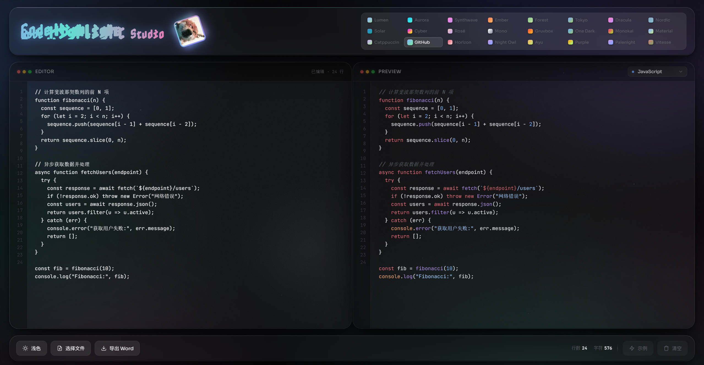
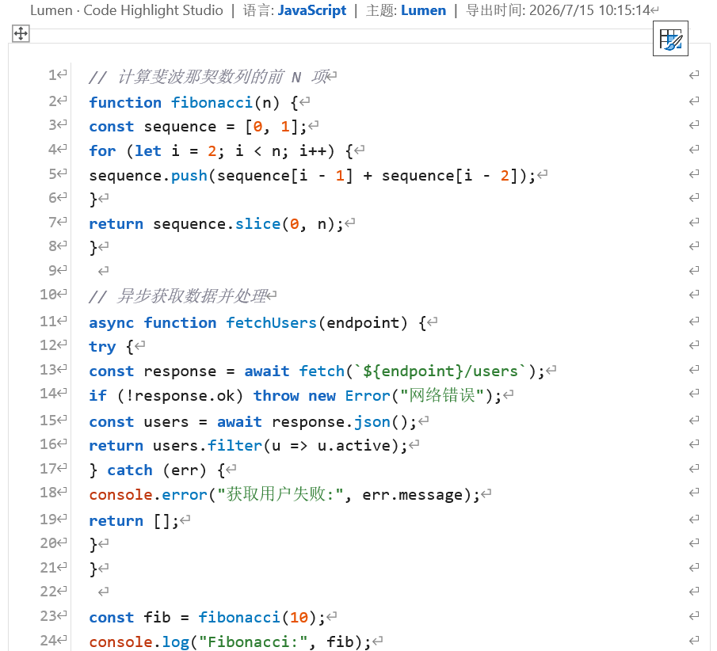
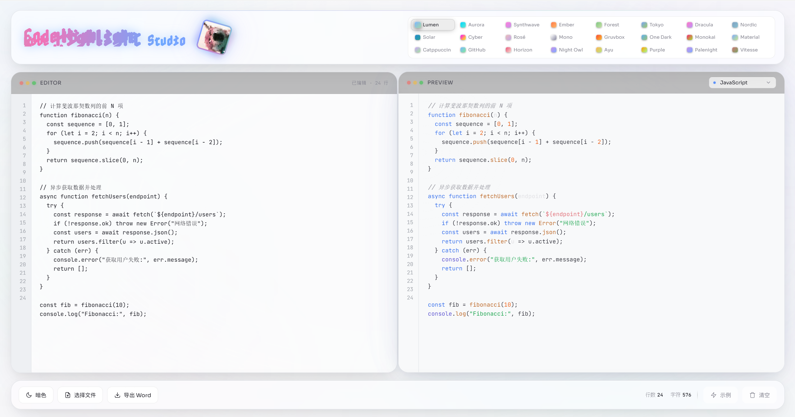

# 代码高亮工坊 (Code Highlight Studio)

一个基于 Web 的实时代码高亮工具，支持文件导入、明暗界面切换、24 套主题配色，并可一键导出带高亮的 Word 文档。

## 功能特点

- **实时高亮预览**：左侧编辑代码，右侧即时渲染高亮效果
- **文件导入**：支持点击「选择文件」按钮或直接拖拽代码文件到页面，自动读取内容
- **自动语言检测**：根据文件后缀识别语言，未知后缀则调用 highlight.js 自动推断
- **明暗界面切换**：左下角切换浅色 / 暗色界面模式，偏好自动保存
- **双版本主题**：24 套暗色主题各配有一套浅色变体，切换明暗模式时自动跟随
- **导出 Word**：一键导出保留高亮样式的 Word 文档
- **液态玻璃 UI**：玻璃拟态界面设计，支持鼠标追踪光效与边缘流光

## 支持的语言

支持 30+ 种编程语言，包括但不限于：

JavaScript、TypeScript、Python、Java、C、C++、C#、Go、Rust、Ruby、PHP、Swift、Kotlin、SQL、HTML、CSS、SCSS、JSON、YAML、Markdown、Shell、Bash、PowerShell、Lua、R、Dart、Scala、Perl、Groovy、Objective-C、VB.NET、Dockerfile、Makefile 等。

## 支持的主题

| 主题 | 风格 |
|------|------|
| Lumen | 液态玻璃 · 柔和暗色 |
| Aurora | 极光 · 青蓝主调 |
| Synthwave | 合成波 · 紫粉霓虹 |
| Ember | 余烬 · 暖橙红 |
| Forest | 森林 · 翠绿主调 |
| Tokyo Night | 东京夜 · 深蓝紫调 |
| Dracula | 吸血鬼 · 经典暗紫粉 |
| Nordic | 北欧 · 冷蓝灰 |
| Solarized | 日光暗 · 经典青蓝琥珀 |
| Cyberpunk | 赛博朋克 · 霓虹黄绿粉 |
| Rose Pine | 玫瑰松 · 柔和玫瑰金紫 |
| Mono | 极简单色 · 银白灰阶 |
| Gruvbox | 暖色复古 · 土金棕 |
| One Dark | Atom · 冷蓝紫 |
| Monokai | 经典 · 黄绿粉紫 |
| Material | Material Design · 清爽蓝绿 |
| Catppuccin | 猫布奇诺 · 柔和薰衣草粉紫 |
| GitHub | 经典蓝灰 · 开发者标配 |
| Horizon | 日落暖橘 · 晚霞色调 |
| Night Owl | 暗夜猫头鹰 · 深蓝紫 |
| Ayu Dark | 暗金 · 暖色暗夜 |
| Shades of Purple | 紫韵 · 全紫色调 |
| Palenight | 淡紫夜 · 紫调 Material |
| Vitesse | 极速暗夜 · 现代极简 |

每套主题均提供暗色与浅色两种版本，切换界面明暗模式时自动匹配。

## 使用方法

1. 直接在浏览器中打开 `code-highlighter.html`
2. 在左侧编辑器输入或粘贴代码，或点击左下角「选择文件」按钮 / 拖拽文件到页面导入代码
3. 在预览区顶部下拉菜单选择编程语言（导入文件时会自动检测）
4. 点击顶部主题色块切换高亮配色
5. 点击左下角太阳 / 月亮图标切换浅色或暗色界面
6. 点击底部「导出 Word」按钮保存带高亮的文档

## 技术栈

- HTML5 / CSS3 / JavaScript
- [highlight.js](https://highlightjs.org/) - 代码高亮引擎
- Google Fonts (Sora, JetBrains Mono, Nabla)

## 浏览器支持

支持现代桌面浏览器（Chrome、Edge、Firefox、Safari）。由于使用 `backdrop-filter`、CSS 变量与 File API，建议使用最新版本浏览器以获得最佳体验。

## 许可

MIT License
